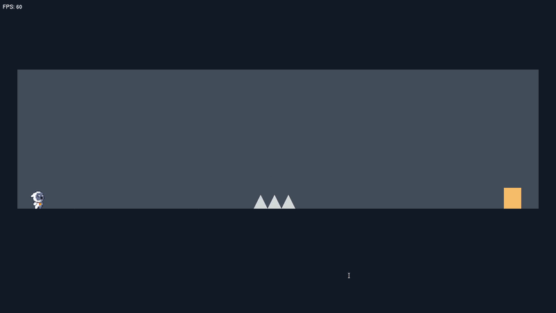

# Level Devil Clone: using openGL

<div align="center">
  
</div>

## 📖 Overview
Developed as a coursework project for my Computer Science program, this game is a custom-built, 2D precision platformer inspired by **"Level Devil."** Per my instructor's requirements, the goal was to recreate the unforgiving, trap-based platforming experience from scratch without the use of a commercial game engine (like Unity or Godot). 

Every system in this game—from the kinematic physics to the spatial collision detection—was engineered in **C++** and rendered using **OpenGL/GLUT**.

## 📸 Gallery

<div align="center">
  
  
</div>

## Technical Showcase

To meet the strict requirements of replicating a precision platformer, I built a bespoke 2D physics and rendering engine. Here are the core technical achievements:

### 1. Kinematic Physics & Gravity Simulation
* **Sub-step Velocity Updates:** Custom gravity implementation that applies continuous downward acceleration to the player's vertical velocity vector, simulating realistic weight and momentum.
* **State-Driven Jump Mechanics:** Engineered a robust, state-based jump system tracking airborne status. This allows for a precise **Double-Jump** mechanic that resets flawlessly upon grounded collision resolution.

### 2. AABB Collision Detection & Resolution
* **Spatial Intersection:** Implemented Axis-Aligned Bounding Box (AABB) algorithms to calculate overlaps between the player entity and static world geometry (platforms, traps, and walls).
* **Kinematic Resolution:** When a collision is detected, the engine instantaneously zeroes out the opposing velocity vector and snaps the player's coordinate space to the surface boundary, preventing clipping or "sinking" through the floor.

### 3. Bare-Metal Rendering
* **OpenGL Primitives:** Discarded heavy sprite libraries in favor of rendering the environment purely through OpenGL geometric primitives, managed via direct shape rendering matrices.
* **Optimized Game Loop:** Handled continuous screen-refresh loops to clear buffers and redraw shapes in real-time, ensuring a fluid framerate crucial for a high-difficulty platformer.

## 🛠️ Tech Stack

* **Core Language:** C++
* **Graphics API:** OpenGL
* **Windowing & Input:** FreeGLUT / GLUT
* **Environment:** Arch linux

## 🎮 Controls

The controls are intentionally tight and responsive to accommodate the punishing level design:

* **`A` / `D`** (or `Left` / `Right` Arrows) — Horizontal Movement
* **`W` / `up` / `Spacebar`** — Jump
* **`B`** — mutes the music / **`M`** — mutes the game
* **`Esc`** — Quit Game

## ⚙️ Build & Installation

### Prerequisites (Linux)
You will need a C++ compiler (`g++`) and the OpenGL/GLUT development libraries. 

For Arch Linux:
```bash
sudo pacman -S base-devel freeglut mesa gcc
```
Compilation
1. Clone the repository: 
```bash
git clone https://github.com/Distorver/College-Game-Project.git
cd College-Game-Project
```
2. Compile via g++:
```
g++ main.cpp -o leveldevil -lGL -lGLU -lglut
```
3. Execute the game:
```
./leveldevil
```
***
Developed by **Ali Ayman** as an academic exploration of lower-level game development and C++ application architecture.
